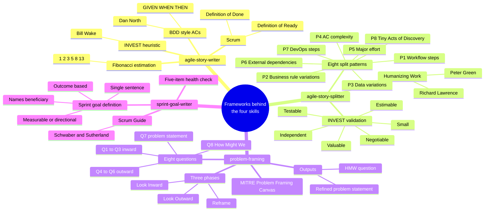

# Agile Story Skills

A bundle of four GitHub Copilot Agent Skills that take an engineering or product team from
a vague request through framing, story authoring, story splitting, and sprint goal
setting. Output is tool-agnostic — it pastes cleanly into Jira, GitHub Issues, Linear,
and Azure DevOps.


## Why This Exists

- Teams lose time rewriting vague stories that are missing scope boundaries and testable
  acceptance criteria.
- Stories arrive too large to estimate, and splitting them by gut feel produces
  horizontal slices that never ship value alone.
- Sprints begin without an outcome-based goal, so the team has no daily trade-off lever
  when a story drifts.
- Worst of all, work starts before the problem is framed — and the cheapest defect to
  prevent is the wrong problem.

## The Four Skills

| # | Skill | Use it when |
|---|-------|-------------|
| 1 | [`agile-story-writer`](.github/skills/agile-story-writer) | You need a complete, unambiguous story with GIVEN/WHEN/THEN ACs, scope IN/OUT, NFRs, and DoR/DoD. |
| 2 | [`agile-story-splitter`](.github/skills/agile-story-splitter) | A story is > 8 points, can't be estimated, or an epic needs decomposing into 2–5 sprint-sized vertical slices. |
| 3 | [`problem-framing`](.github/skills/problem-framing) | A request is vague, teams disagree on the real problem, or discovery is needed before backlog grooming. |
| 4 | [`sprint-goal-writer`](.github/skills/sprint-goal-writer) | Sprint planning needs a single outcome-based objective drawn from 3–10 committed stories. |

## Frameworks and Standards

Each skill encodes established agile / discovery practice rather than ad-hoc rules.
Keep the source material in mind when modifying skill behaviour.

| Skill | Framework / Standards it encodes |
|---|---|
| [`agile-story-writer`](.github/skills/agile-story-writer) | BDD-style acceptance criteria (GIVEN/WHEN/THEN, Dan North) · INVEST quality heuristic (Bill Wake) · Fibonacci story-point estimation · Scrum Definition of Ready / Definition of Done |
| [`agile-story-splitter`](.github/skills/agile-story-splitter) | Richard Lawrence & Peter Green — Humanizing Work eight story-split patterns (P1 Workflow Steps → P8 Tiny Acts of Discovery) · INVEST validation |
| [`problem-framing`](.github/skills/problem-framing) | MITRE Problem Framing Canvas — three phases (Look Inward / Look Outward / Reframe), eight questions, "How Might We" reframing |
| [`sprint-goal-writer`](.github/skills/sprint-goal-writer) | Scrum Guide (Schwaber & Sutherland) — sprint goal as a single outcome-based objective providing the team focus and flexibility |



## Quick Start

First, get the skills onto your machine. Pick whichever fetch method suits you, then
follow with either the project-scoped or personal install step.

### Fetch the skills

**Option A — clone the repo (tracks `main`):**

```bash
git clone https://github.com/alwyndsouza/agile-story-skills.git
cd agile-story-skills
```

**Option B — download a pinned release tarball (recommended for shared installs):**

```bash
gh release download v1.1.0 --repo alwyndsouza/agile-story-skills --archive=tar.gz
tar -xzf agile-story-skills-1.1.0.tar.gz
cd agile-story-skills-1.1.0
```

### 1) Project-scoped install

Copy the four skill directories into the target repo's `.github/skills/`.

```bash
mkdir -p <target-repo>/.github/skills
cp -R .github/skills/agile-story-writer    <target-repo>/.github/skills/
cp -R .github/skills/agile-story-splitter  <target-repo>/.github/skills/
cp -R .github/skills/problem-framing       <target-repo>/.github/skills/
cp -R .github/skills/sprint-goal-writer    <target-repo>/.github/skills/
```

### 2) Personal install

Copy the four skill directories into your user-level Copilot skills folder.

```bash
mkdir -p ~/.copilot/skills
cp -R .github/skills/agile-story-writer    ~/.copilot/skills/
cp -R .github/skills/agile-story-splitter  ~/.copilot/skills/
cp -R .github/skills/problem-framing       ~/.copilot/skills/
cp -R .github/skills/sprint-goal-writer    ~/.copilot/skills/
```

### 3) Git submodule (for teams who want updates to flow with `git pull`)

From the target repo's root:

```bash
git submodule add https://github.com/alwyndsouza/agile-story-skills.git .github/skills/_upstream
# Symlink each skill into place (or use cp -R for a flat copy)
for skill in agile-story-writer agile-story-splitter problem-framing sprint-goal-writer; do
  ln -s _upstream/.github/skills/$skill .github/skills/$skill
done
```

To upgrade later: `git submodule update --remote .github/skills/_upstream`.

## How to Use

Each skill ships several invoke modes. Most are triggered by natural-language prompts
that match the keywords in the skill's description — the explicit slash command is just
the most direct path.

### `agile-story-writer`

Generate a complete story from a rough description, or rewrite an existing one.

| Mode | Command / Prompt |
|---|---|
| Explicit slash | `/agile-story-writer Migrate ETL job to DLT with quality checks` |
| Natural language | `Write a story for adding alerting on failed ingestion jobs.` |
| Rewrite | `Improve this story: [paste current ticket text]` |
| Bug | `Write a bug ticket for duplicate invoice records in daily load.` |
| Spike | `Create a spike to investigate row-level lineage in Databricks.` |

### `agile-story-splitter`

Break an oversized story or epic into 2–5 sprint-sized vertical slices.

| Mode | Command / Prompt |
|---|---|
| Explicit slash | `/agile-story-splitter [paste oversized story]` |
| Natural language | `This story is too big, split it: [paste card]` |
| Pattern-pinned | `Split this using workflow steps: [paste card]` (forces P1) |
| Auto-flag from writer | When `/agile-story-writer` produces > 8 points, it offers to invoke this skill |

### `problem-framing`

Walk the team through the MITRE canvas before any story is written.

| Mode | Command / Prompt |
|---|---|
| Explicit slash | `/problem-framing` (then answer Q1 onward, one question per turn) |
| Natural language | `Frame the problem for: [description]` / `We need to do problem framing` |
| Context dump | `Here's what we know: [dump]. Frame it.` |
| Non-interactive | `Just frame this for me: [description]` |

### `sprint-goal-writer`

Draft an outcome-based sprint goal from a committed story list.

| Mode | Command / Prompt |
|---|---|
| Explicit slash | `/sprint-goal-writer [paste story list]` |
| Natural language | `Write a sprint goal for these stories: [paste]` |
| Revision | `Improve this sprint goal: [paste current goal]` |
| Health-check only | `Health-check this sprint goal: [paste]` (runs only the checklist) |

### Typical end-to-end flow

1. `/problem-framing` — turn a vague request into a refined problem statement and a
   How-Might-We question.
2. `/agile-story-writer` — generate the first story from the HMW.
3. `/agile-story-splitter` — invoked automatically when the writer flags > 8 points.
4. `/sprint-goal-writer` — once the sprint is committed, draft the outcome-based goal.

## What Every Story Contains

| Section | Enforced Outcome |
|---|---|
| Title / Type / Priority / Points | Specific, estimable work item with clear classification and rationale |
| Context + User Story | Role-based purpose and measurable business/operational outcome |
| Scope IN / Scope OUT | Explicit boundaries that prevent hidden scope creep |
| Acceptance Criteria | Objective GIVEN/WHEN/THEN checks for deterministic validation |
| Technical Notes + NFRs | Implementation guidance, dependencies, and quality constraints |
| Definition of Ready / Done | Shared checklist for planning quality and completion standards |

## Repo Structure

```text
agile-story-skills/
├── .github/
│   ├── skills/
│   │   ├── agile-story-writer/        # Story authoring (tool-agnostic format)
│   │   │   ├── SKILL.md
│   │   │   ├── examples/{good,bad}-story.md
│   │   │   ├── references/{personas,story-format-guide}.md
│   │   │   └── assets/story-template.txt
│   │   ├── agile-story-splitter/      # Humanizing Work 8-pattern splitter
│   │   │   ├── SKILL.md
│   │   │   ├── examples/split-example.md
│   │   │   └── references/split-patterns.md
│   │   ├── problem-framing/           # MITRE Problem Framing Canvas (3 phases / 8 Qs)
│   │   │   ├── SKILL.md
│   │   │   ├── examples/framing-example.md
│   │   │   └── assets/canvas-template.md
│   │   └── sprint-goal-writer/        # Outcome-based sprint goal drafter
│   │       ├── SKILL.md
│   │       ├── examples/goal-example.md
│   │       └── assets/goal-template.md
│   ├── workflows/validate-skill.yml   # CI validation for structure, markdown, frontmatter
│   ├── ISSUE_TEMPLATE/                # Skill improvement issue template
│   ├── CODEOWNERS                     # Ownership and review enforcement
│   └── PULL_REQUEST_TEMPLATE.md       # PR quality checklist
├── docs/
│   └── enterprise-deployment-guide.md # Enterprise installation and governance guidance
├── README.md
├── CHANGELOG.md
├── CONTRIBUTING.md
└── SECURITY.md
```

## Enterprise Deployment

See [docs/enterprise-deployment-guide.md](docs/enterprise-deployment-guide.md).

## Contributing

See [CONTRIBUTING.md](CONTRIBUTING.md).

## Changelog

See [CHANGELOG.md](CHANGELOG.md).

## Roadmap

- Org-level skills support (coming)
- Custom agent wrapping the four skills (planned)
- Jira / Linear / GitHub Issues push via MCP (future)
