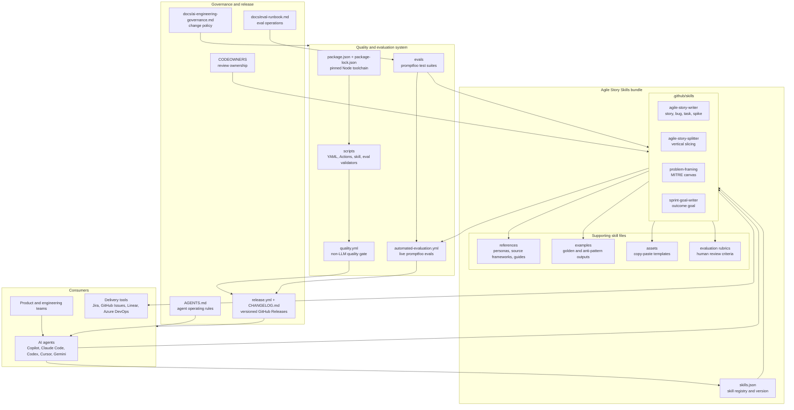
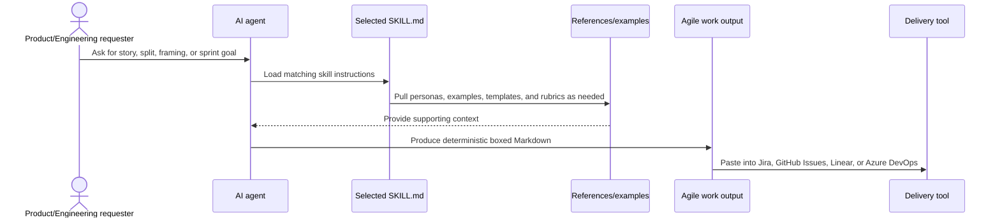
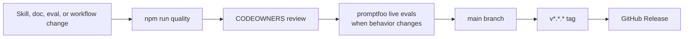

# High-Level Architecture

This repository is a portable AI skill bundle. It packages four agile delivery skills,
their supporting references and examples, automated quality checks, and release assets.

## Runtime Flow

## Maintenance Flow

## Architecture Notes

- Skills are plain Markdown contracts, so they can be copied into project-scoped or
  personal agent skill directories.
- `skills.json` is the programmatic manifest for skill discovery and version alignment.
- Supporting references keep `SKILL.md` focused while preserving deeper domain guidance.
- `quality.yml` is the non-LLM gate for Markdown, YAML, workflow syntax, skill structure,
  eval config shape, and links.
- `automated-evaluation.yml` is the live model gate for output behavior and drift.
- Releases package a stable skill bundle for teams that need reproducible agent behavior.
